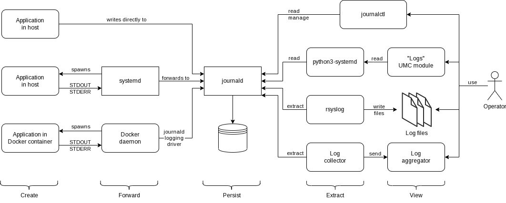

# Logging concept for UCS

- Audience: Dev, PM, PS
- Authors: @dtroeder, @phahn
- State: Accepted and published
- References: Concept was implemented in ADRs
  [0004 Logging Topology](https://git.knut.univention.de/univention/decision-records/-/blob/main/dev/0004-logging-topology.md),
  [0005 Log levels](https://git.knut.univention.de/univention/decision-records/-/blob/main/dev/0005-log-levels.md),
  [0006 Log format](https://git.knut.univention.de/univention/decision-records/-/blob/main/dev/0006-log-format.md),
  [0007 Log messages](https://git.knut.univention.de/univention/decision-records/-/blob/main/dev/0007-log-messages.md),
  and [0008 Structured logging](https://git.knut.univention.de/univention/decision-records/-/blob/main/dev/0008-structured-logging.md).

[[_TOC_]]

Logging is an integral part of software development and maintenance.
It serves different purposes for different people and at different times during its lifecycle.

- Univention developers use logging to track the internal state of software in its development and
  maintenance phase.
- During regular operation time, Univention system integrators and customer operators use logging to
  ensure a correct software setup, document service operations, and detect service errors.
- When errors occur, Univention supporters and customer operators use logging to record the internal
  state of software to create bug reports.

This concept describes rules, technologies, and topologies for the development and operation of software,
that will increase the value of logs for both Univention and its customers while at the same time
reducing development and maintenance costs.

Logging is part of a broader observability concept.
Work on that concept has not started yet.
Feel free to add to the collection of ideas and requirements in the corresponding
[merge request](https://git.knut.univention.de/univention/internal/research-library/-/merge_requests/24).

## Current state and problems

Currently, logging is handled inconsistently in Univention's products.

At the moment, multiple logging frameworks are in use:

- Univention software compiled from C-sources uses the `Univention Debug` C-library.
- The UMC, all UMC modules, UDM, and the AD connector use the `Univention Debug` Python library.
  - There is work underway to transparently replace the `Univention Debug` Python library with the
    Python `logging` library (which is a Python-wrapper to the C-library).
- Many UCS and almost all UCS@school Python code use the Python `logging` library.
- Newer UCS@school Python code uses the `Loguru` Python-library.

In many components, log levels, log targets, log formats, log rotation, timestamps, and configurability
differ greatly.

- The `Univention Debug` library uses non-standard log levels.
- Often, messages for problem debugging (lower than "informational") are not spread enough amongst the
  existing lower log levels. When using "debug", "trace"-level messages appear, making logs unreadable.
- While for software installed in the host UCR, variables that uniformly configure log rotation
  using the Linux `logrotate` service exist, no such thing exists for logs created by Docker containers.
  This has led to lots of bug reports.
- Log rotation done by the Python `logging` libraries `TimedRotatingFileHandler` (not the Linux
  `logrotate` service) executed in the host work as expected but does not follow the rules of the
  previously mentioned UCRVs.
- Log rotation using `TimedRotatingFileHandler` from the Python `logging` library, executed inside Docker
  containers, leading to corrupted log files.
  - This can be mitigated by using `WatchedFileHandler` in the Python app in the Docker container and
    letting a service in the host system do the log rotation. However, The configuration of a Docker
    app's host resources is undesirable.
- When initialization or low-level errors occur, logs created by Python software in Docker containers do
  not contain errors printed to standard out (STDOUT) and standard error (STDERR).
- The format of log lines has not been standardized, making them harder to parse for both humans and
  machines.
- Timestamps are used with different formats, with and without time zones. There are even log files
  _without_ timestamps. This leads to support and development staff members wasting time
  correlating entries in different files.

### Types of software and execution environments

Logs for different kinds of software and in different environments are created and handled differently.

Univention software

1. Execution environment
   1. running in the host system (Debian package)
   2. running in a Docker container
2. Type of software
   1. CLI
      1. non-interactive
      2. interactive
   2. Web interface backend
   3. Long-running service

3rd party software

1. Execution environment
   1. running in the operating system (Debian package)
   2. running in Docker

---

#### Univention software

1. Execution environment
   1. Univention software running in the host system generally writes their logs directly to files.

      - The `Univention Debug` and Python `logging` libraries are used.
      - A few exceptions exist, like email server components using the Unix `syslog` library routines.
      - Log rotation is configurable through UCRV if done by the Linux `logrotate` service or hard
        coded if done by the Python `logging` library.

   2. Univention software running in Docker.

      - ATM software running in Docker containers is always packaged as an App Center app. There exist
        two scenarios:
        - Usage of the app is triggered by a change in the LDAP DB, and the executed code is in the
          `listener_trigger`, started by an "App Center converter" service.
          In that case, logging is done by writing to STDOUT.
          This is captured by the "App Center converter" service, which runs in the host and
          writes to a log file `/var/log/univention/listener_module/<app>.log`.
          That file is automatically rotated using the Linux `logrotate` service, configurable with
          UCR.
        - The Docker container starts a long-running process. It writes its logs directly to files
          on a bind-mounted volume. It also rotates its log files on its own, which may not be
          configurable. Usually, the Python `logging` library is used. Newer UCS@school Python code
          uses the `Loguru` library.

2. Type of software
   1. CLI
      - non-interactive
        - If meant to be run by other software (e.g., in a Debian maintainer or join script), all
          output is usually sent to STDOUT. The calling software is responsible for dealing with the
          output.
        - Complex software often writes INFO or ERROR level output to STDOUT and _additionally_
          to a log file, often with a configurable log level.

      - interactive
        - Same as for "non-interactive".
        - If (parts of) the output is meant to be used by other software (e.g. in a pipe), then
          status messages and logs are written to STDERR, and the text meant for further processing
          to STDOUT.

   2. Web interface backend
      - UMC modules are installed in the host and use the `Univention Debug` library to write directly
        to log files.
      - HTTP API backends for Javascript frontends (currently exist only in UCS@school, but in the
        future also in UCS) are installed as Docker apps. They log using Python `logging` or `Loguru`
        and have the problems mentioned earlier with log rotation.

   3. Long-running service
      - Long-running processes write their logs directly to files. The log level is usually
        configurable. Log rotation is traditionally done by the Linux `logrotate` service, which either
        restarts the service or sends a `HUP` signal to reopen the log file.

#### 3rd party software

1. Execution environment
   1. running in the operating system (Debian package)
      - Usually logs directly to files. Paths and log levels are usually configurable.
      - The software itself sometimes does log rotation, but more often, it is expected to be done by
        the Linux `logrotate` service.
   2. running in Docker
      - Startup output always goes to STDOUT.
      - Application logs sometimes go to STDOUT, sometimes into files on a mounted "data volume".
        Both variants are common, although best practice is logging to STDOUT.
      - With the current UCS Docker logging driver configuration, logs sent to STDOUT are hard to find
        and read while the app is installed and even worse, they are lost during app upgrade and
        after app removal.
      - Log rotation is either done by the app itself when logging into a file or not at all when
        logging to STDOUT (risk of disk space exhaustion).

## New logging concept

In the new logging concept, separated components implement different aspects of logging:

1. Applications emit formatted (incl. structured) log messages.
   Shared libraries ensure consistent configurability, log levels, formatting, timestamps, and where logs
   are sent to.
2. Log messages are received and locally persisted by _journald_.
   When journald is not the process spawning the log emitting software, the log receiving process is
   responsible for forwarding messages to journald.
   journald is responsible for log rotation.
3. Logs can be read using the `journalctl` CLI or a UMC module.

Messages can optionally be extracted from the binary journald database to text files by _rsyslog_.
They must then be rotated using _logrotate_.

Locally persisted logs are optionally forwarded to log collectors and analyzers.
Forwarders enrich messages with metadata about the host, filename, etc.



### Create

Applications emit formatted (incl. structured) log messages.

Shared libraries ensure consistent configurability, log levels, formatting, timestamps, and where logs
are sent to.
Developers only need to configure the application's namespace.

#### Log targets

All Univention software, regardless of where it is installed and its implementation language,
emits its log messages either to STDERR (to be captured and forwarded by the spawning process)
or sends them directly to journald (e.g., using `systemd.journal.JournalHandler` in Python
and `systemd-cat` in a shell).

CLI that wishes to emit text to be read by users or to be used by other software (e.g., in a shell pipe),
sends that text to STDOUT.
That text will _not_ be logged.

The decision to send log messages directly to journald should not be taken lightly.
In Kubernetes no local journald service exists.
If the software is expected to run in Kubernetes (e.g. as part of nubus) another solution should be found.

Spoiler: Rsyslog can be configured to read journald's data and store it in clear text files.

#### Log levels

Six log levels exist.
Univention developers MUST use them according to the following rules.
See next section (_Log messages_) for how messages should look like and examples at each log level.

- `TRACE`: Information about a system-internal event or state without business context.
  Audience: developer.
  - When the used logging library doesn't support a native `TRACE` level, use the `DEBUG` level instead.
- `DEBUG`: Information about a technical event or state with business context. Audience: support.
- `INFO`: Information about a successful application/business event. Audience: operator.
- `WARNING`: Information about a potential danger, an unexpected error that could be handled by the
  software, reduced performance or feature set. Audience: operator.
  - Do not use it for _expected_ problems, like wrong user input, as that is not an error of the
    software. Log expected events at `DEBUG` or `INFO` level, except if they pose a danger.
- `ERROR`: Information about an erroneous event of any (internal to business) level that cannot be
  handled automatically but does not hinder the continued operation of the service as a whole.
  Audience: operator.
- `CRITICAL`: Information about an erroneous event that affects not only the current transaction
  but all future transactions, too. Audience: operator.

The creation of additional log levels is discouraged.
We suggest adding additional labels to log lines instead.
When found in other languages or libraries level `NOTICE` should be mapped to `INFO` and level `FATAL`
should be mapped to `CRITICAL`.

The above log levels are mapped by journald to Syslog priorities (`man 3 syslog`) following [RFC 5424 section 6.2.1](https://datatracker.ietf.org/doc/html/rfc5424#section-6.2.1) in the following way:

- `TRACE` and `DEBUG` → Priority `7` (Debug)
- `INFO` → Priority `6` (Informational)
- `WARNING` → Priority `4` (Warning)
- `ERROR` → Priority `3` (Error)
- `CRITICAL` → Priority `2` (Critical)

Syslog priorities `0` (Emergency), `1` (Alert) and `5` (Notice) are not used.

---

For complex software projects, developers are encouraged to give operators the option to set log levels
per component.
With hierarchical loggers, Python logging frameworks already have the required infrastructure.
A Univention library should enable developers to effortlessly offer a consistent configuration to
operators.

#### Log messages

When developing and writing log messages do not assume knowledge of the context (the code) surrounding
the logging call.
Readers of the message will not know it.

The content of a log message should match the log level and audience.

- Logs lines intended only for developers and support (`TRACE` and `DEBUG`):
  - … can assume intimate technical knowledge of the application.
  - The context such a message should include is that of a _technical subsystem_.
  - E.g. for a message about opening a network connection, it must be clear that we're in the _database
    port_, but there is no need to include a wider context like that we are in the process of reading
    a group object.
  - E.g., `TRACE Cleared ucsschool.lib School objects cache.`
  - E.g., `TRACE Loaded plugin. name='foo.py'`
  - E.g., `DEBUG Opened connection to configuration database. host='foo.bar' port=3210`
  - E.g., `DEBUG Received IP address. ip='10.20.30.40'`
  - _Only_ when a _dedicated_ configuration option has been enabled, messages in these log levels can
    include sensitive data (such as passwords or tokens).
- Logs lines intended only for operators (everything from `INFO` until `CRITICAL`):
  - … must _not_ assume internal technical knowledge of the application.
  - The context such a message should include is that of a _business use case_.
  - `INFO`: The message can often be short, as its "context" is the business use case itself.
    It should include only the event and relevant data.
    - E.g.: `INFO Created user. dn='uid=foo,cn=...'`
    - E.g.: `INFO Finshed … task. <object>=<id> duration=1.32 items=47`
  - `WARNING`: The message should include the problem and if available a hint how to avoid it in the
    future.
    - E.g.: `WARNING Deactivating … feature. Install <package> and set UCRV <k>=<v> to enable it. plugin='<name>.py'`
    - E.g.: `WARNING Changing membership took 30s. Avoid more than 5.000 members, check system load, try raising worker count. dn='cn=Domain Users,cn=...'`
  - `ERROR`: he message should include (besides the business case during which it was logged) as much
    information about the problem as possible, without divulging sensitive data.
    Purely internal error messages without business context should be avoided.
    See example a few paragraphs below.
    - E.g.: `ERROR Failed to change group membership: permissionDenied: Zugriff verweigert. dn='cn=group,dc=...' old_users=['uid=..', '..'], new_users=..`
  - `CRITICAL`: Besides everything that is written for `ERROR` it should include the information _why_
    the software cannot continue. It should be written so that an operator understands _why_ the software
    is shutting down.
    - E.g.: `CRITICAL Failed to load configuration, aborting: Error reading configuration file: Parsing JSON at line 1. path='/foo/bar.xml'`
    - E.g.: `CRITICAL Cannot connect to <service>, shutting down: TimeoutError: Connection timed out: errno 110 host='10.20.30.40' port=22 errno=110 ttl=60`

Understanding log messages must not depend on previous log messages, as those may not be logged with the
same log level, be extracted to a different file or in asynchronous / multi-threaded applications may
appear interleaved or way before the one being read.

Log messages should name the event and additional data separately (e.g. `Missing file. path='/foo/bar'`).
That simplifies parsing, classification, filtering and counting.
It also keeps the log lines more consistent.
Structured logging is recommended.

When an operation in a called function fails, the function can only log what it knows.
It may not be able to log information about the wider context.
Do not pass the context into the function.
Instead, use exceptions and add information on each level.
For example:

- Call chain: `main() -> read_queue() -> parse_file(path) -> parse_json(string)`
- `parse_json()` encounters an error parsing the passed in string.
  - It won't log it. The reader wouldn't know where it came from.
  - It raises `ValueError("Parsing JSON at line 12.")`
- `parse_file()` catches the `ValueError` and adds what it knows: the filename.
  - It won't log it. Maybe it's OK it happens. Maybe it happens 10000 times. It cannot decide or handle it.
  - It raises: `FormatError(str(exc), path=path) from exc`
- `read_queue()` adds its context (that a queue file with an ID was being read).
  - It raises: `QueueError(f"Error reading queue file: {exc!s}", qid='d32f61', **exc.__dict__) from exc`
- `main()` knows how to handle this.
  - It logs: `logger.warning(f"Queue read error, skipping item: {exc!s}", **exc.__dict__)`

The output will be a single log line containing all information:

```text
<timestamp> WARNING Queue read error, skipping item: Error reading queue file: Parsing JSON at line 12. path='/foo/bar' qid='d32f61'
```

The kwargs (`path='/foo/bar' qid='d32f61'`) were added by our logging library as it supports structured logging.

Structured logging is also recommended
because UCS products produce very few metrics
that customers can use to observe and predict system behavior.
UCS also supports tracing only very sparingly,
together with the lack of metrics leading to a low observability.
Structured logs allow customers to configure their log aggregators to extract data relevant for them.
Being able to create their own metrics from parsing the logs allows them to get answers
without Univention having to know the questions and providing new interfaces.

When using structured logging, we have the option to store each line as a JSON object.
That format is very easy to parse and analyse for log aggregators.
But reading JSON is not very comfortable for humans.
As a compromise between readability for humans and machines the use of [logfmt](https://brandur.org/logfmt)
for _only_ the data part is recommended.
The result:

```text
2023-10-27T08:22:57.275138+00:00 INFO  31f863092ade modified group | dn='...' gidNumber=5124
2023-10-27T08:22:58.123454+00:00 DEBUG b0ca915ec433 received request | headers={..} method='POST'
```

That can be parsed or tokenized like this:

```text
<timestamp> <log level> <request ID> <message> | <structured data (logfmt)>
```

#### Log format

- Log lines SHOULD be formatted so that all required fields are at the beginning and have a fixed width.
  This "table-like" view allows humans to parse logs faster.
- Log lines MUST start with a timestamp.
  - Timestamps MUST contain a time zone.
  - The time zone SHOULD be UTC, but it can be local. All log files MUST use the same time zone.
  - Timestamps MUST have sub-second accuracy, by default microseconds.
  - Timestamps MUST conform to ISO 8601: `YYYY-MM-DDTHH:MM:SS.ffffff+HH:MM[:SS[.ffffff]]`
- Log lines MUST contain the severity (log level). See the previous section.
- Log lines MUST contain the source package and module name where they originate from.
  Developers and operators need to know this value (`<package>.<module>`) for fine-grained log level
  configuration (see next section).
- Log lines MAY contain the source file and line number where they originate from, especially for debug/trace levels.
- Log lines MAY contain the process ID (PID)
- Log lines MAY contain a correlation/reference ID. Operators use it to track and correlate requests and
  events across service and network boundaries. They may also use it to correlate log lines of services
  that process multiple requests in parallel.
- Log lines MUST contain the log message.
  - Structured logging is encouraged.
    In that case, the log message SHOULD contain only the event, not the data.
- Log lines MAY contain a section (visually separated from the message) with data in a JSON-parsable
  format.
  - In structured logging, this section is required.

The values in rules starting with _Log lines MAY contain_ can either be part of the metadata section
left of the message or of the structured data.

##### Example

```text
2023-10-27T08:22:57.275138+00:00 INFO  31f863092ade modified group | dn='...' old={..} new={..}
2023-10-27T08:22:58.123454+00:00 DEBUG b0ca915ec433 received request | headers={..} method='POST', json={..}
2023-10-27T08:22:58.351345+00:00 TRACE b0ca915ec433 cache hit | hash='...' ttl=...
2023-10-27T08:22:59.123458+00:00 INFO  b0ca915ec433 created user | dn='...' username='...'
2023-10-27T08:22:59.348452+00:00 ERROR 52b6dc808ac7 deleting group | dn='...' traceback=[..]
2023-10-27T08:22:59.485904+00:00 TRACE 31f863092ade request timing | total=.. db=..
2023-10-27T08:22:59.492431+00:00 TRACE 52b6dc808ac7 request timing | total=.. db=..
```

#### Sensitive data

What is "sensitive data" and how to handle it?

We are no experts on the matter, so we should get in contact with a data protection officer to verify
the following rules:

- Generally, all _non-technical_ user-related data (e.g., `firstname`, `birthday`) is most likely
  deserving data protection and must not be logged.
- Purely _technical_ user-related data (e.g., `uidNumber`, `memberUid`) is a grey zone. While it may not
  be personal data, it can be used to identify an individual.
  So, it should be avoided, but it is not strictly forbidden.
- Database IDs can be logged. Data protection policies usually allow that for operational reasons.
  - But database IDs can contain personal information, e.g., when the `username` is constructed from a
    real name (and the `username` is part of the `DN`).
    From what I understood, they can be logged nevertheless (operational necessities).
- Data that can be used for privilege escalation or system intrusion, like passwords and access tokens,
  must not be logged.

Generally, sensitive data should _not_ be logged.
Only when a _dedicated_ configuration option has been enabled, messages in the log levels `TRACE` and
`DEBUG` can include sensitive data.

An application can register one or more UCRVs for that purpose, e.g.:

```text
logging/<application>/log-hashes=<bool>
logging/<application>/log-passwords=<bool>
logging/<application>/log-tokens=<bool>
logging/<application>/log-user-data=<bool>
```

The UCRVs must be disabled by default, and the documentation clearly describes the benefits and warns
of the dangers associated with them.

#### Configuration: Log level

The default log level of each process and individual log levels for each of their submodules should be
configurable.

A UCR key schema is used to store the default log level of each process
and individual log levels for each of their submodules.
The UCRVs will be stored in DCD.
So, the log levels are consistent when a service is deployed multiple times in the domain.
Using DCD allows services to reconfigure themselves when values change.

The proposed UCR key schema is `logging/<application>/<logger>=<level>`.

- `<application>` is the name of the program / script / service the log level(s) should be defined for.
  - The special name `default` means that it will be defined for _all_ applications.
- `<logger>` is the name of a Python package or module,
  e.g. `univention.admin.handlers.users.user` (a single module) or `univention.admin` (a package which includes all handlers, utils, etc.).
  Logger names form a period-separated hierarchie (like the Python package hierarchy) where higher level loggers receive the output of lower level loggers (see [Python logging documentation](https://docs.python.org/3.12/library/logging.html#logger-objects)).
  - The special name `default` means that it defines the applications default log level,
    technically log level of the `root` logger.

| UCR key                                  | Meaning                                                                                                                               |
|------------------------------------------|---------------------------------------------------------------------------------------------------------------------------------------|
| `logging/default=<level>`                | The default log level of _all_ applications (program / script / service), when no dedicated configuration exists. Defaults to `INFO`. |
| `logging/default/<logger>=<level>`       | The log level of the logger named `<logger>` (e.g. `univention.admin.utils`), when used in _any_ application.                         |
| `logging/<application>/default=<level>`  | The default log level of the application `<application>`.                                                                             |
| `logging/<application>/<logger>=<level>` | The log level of the logger named `<logger>` (e.g. `univention.admin.handlers.users.user`), when used in application `<application>`. |

When the program `foo` starts, the logging library will apply values from top to bottom:

1. Set the `root` logger to `logging/default=<level>`.
2. For each `<module>` in `logging/default/<module>=<level>` create a logger and set its log level.
3. Set the `root` logger to `logging/foo/default=<level>`.
4. For each `<module>` in `logging/foo/<module>=<level>` create a logger and set its log level.

All logger instances are singletons.
So "creating" a logger a second time is just modifying the previously created one.

Creating a logger instance that is never used (e.g., for the Python module `univention.mail.dovecot` in a
UCS@school script), is a tiny waist of memory, but nothing else.
Still, that feature should be used with care.

Example:

- UCRVs:
  - `logging/default=INFO`
  - `logging/foo/default=WARNING`
  - `logging/foo/univention.admin.handlers=DEBUG`
- We have two applications: `foo` and `bar`.
  - The application `bar` will generally log at level `INFO` and above (`INFO`, `WARNING`, `ERROR` and `CRITICAL`).
  - The application `foo` will generally log at level `WARNING` and above (`WARNING`, `ERROR` and `CRITICAL`).
    Except when a UDM handler (e.g. `univention.admin.handlers.users.user` for UDM module `users/user`) logs.
    All modules and packages below `univention.admin.handlers` will log at `DEBUG` level.

Setting the log level of a package for all our applications (`logging/default/<logger>=<level>`) will happen very rarely.
A setting like `logging/default/requests.packages.urllib3=DEBUG` is dangerous,
as it'll make _all_ our Python applications log HTTP requests at `DEBUG` level, including sensitive data.
A valid and good use case is to enable such a UCRV for one of our own libraries during a Jenkins run.
E.g. `ucr set logging/default/ucsschool.lib.models=DEBUG && ucs-test -s ucsschool`

---

If an application wishes to support dynamic reconfiguration (without application restart) of its log
levels, the logging library offers to register a callback for UCR keys with DCD.
When a monitored key changes, the library simply executes the four steps mentioned earlier again.

#### Configuration: Human-readable or JSON logs

Usually, operators read logs on the command line.
Thus, immediate readability is a must.

But when logs are forwarded to central log aggregators, they should be analyzed and indexed first.
For that, the text must be parsed to extract the timestamp, log level, message,
and when structured logging is used, the key-value pairs.
When logs are written in JSON, this effort is unnecessary.

The domain-wide (DCD-registered) boolean UCR keys `logging/_ALL_/json` and `logging/<name>/json` toggle
the output of log messages and logged key/value pairs (see section "Log format") between a human-readable
format and JSON.
The default is `false` (write human-readable text).

### Persist

Logs are _data_ produced by applications, just like the "regular data" they create.
As with regular data, the driving factors for its persistence are:

- Reliability, integrity, and security: How secure is the data once the app has handed it over?
- Supported data structures: How well can the data be encoded/decoded for later use?
  What about searching in it?
- Management: How well can the storage be resized, transferred, compressed, and deduplicated?
  What about retention policies?
- Performance: How much resources does it cost to store the data safely?

Solutions have to make compromises on the above qualities.
For example, it would be best for "reliability" if all data transfers were synchronous from end to end:
The sender waits for the storage to write each chunk of data down before sending the next chunk.
But that would incur a high "performance" penalty.
Similar with "management": Splitting data into chunks (log rotation) makes it easier to transfer,
compress, prune, etc.
But those chunks make it harder to analyze the content, ensure its integrity, and not break data
structures.

We have devised a multi-layered setup that caters to all the above qualities:

#### Applications send logs

Applications send their logs either to STDERR or `journald`:

- An application sends its logs to STDERR when it is spawned by `systemd` or another process:
  - That "file" is always exclusively available to the application.
    - No need to create directories, prevent name clashes, etc.
    - There is no need for the application to ensure correct file permissions.
      (Hard coding also blocks the operator from changing them.)
    - There is no need to close and reopen the file descriptor for log rotation, potentially
      requiring to signal or restart the application.
  - The application does not need to add metadata (like the hostname) to logs,
    as that can be done by the software that receives STDERR.
  - The software spawning the application (`systemd` or a Univention app) forwards everything it
    receives on its STDERR file descriptor to `journald`.
    - If it's running in a Docker container, and UCS is configured to use the Docker
      journald logging driver, output on STDOUT and STDERR will automatically be sent to
      `journald`.
    - If it's running in a Docker container in a Kubernetes environment, output on STDOUT and STDERR
      will automatically be sent to a central log collector.
- `journald`:
  - In Python, the `systemd.journal.JournalHandler` can send logs directly to `journald`.
  - From a shell, `systemd-cat` can be used.
  - Please be aware that in Kubernetes no local journald service exists and use this option with care.

For applications, it should be documented in their manual and on the CLI
how their logs can be read using the `journald` command to make the life of operators easier.

There should be no exceptions to the above rule (write logs to STDERR or `journald`).
Not even for programs executed only once (e.g., migration scripts).
They struggle with the same problems as long-running programs (permissions, etc.),
and most importantly, operators would miss their log entries in date-range searches.

Imagine debugging a system where LDAP data was modified in an unexpected way, and the source of the
modification is unknown.
If all programs, join scripts and the directory listener log to `journald` a date-range
search will be immeasurably helpful.

##### Multi-processing applications

Applications that consist of multiple processes (like the UMC and the UDM REST API) should also log to
STDERR or if that's not possible to `journald`.

The main process (the one that was initially started) should pass on its file descriptors for STDOUT and
STDERR to the spawned process.
This way the STDOUT and STDERR of all processes will be sent to `journald` (or wherever Kubernetes sends
it).

As the output of all processes will be merged into one stream, it is strongly recommended to add IDs to
each log line that can be used to split the logs later and to follow requests.
Typical IDs will be a process ID and a request ID.

In the case of the UMC the name of the UMC module should be logged.

```text
<timestamp> <log level> <UMC module> <process ID> <request ID> <message> | <structured data (logfmt)>
# or
<timestamp> <log level> <message> | umc-module='<UMC module>' request-id='<request ID>' pid=<process ID> <more structured data (logfmt)>
```

If a setup with the inheritance of STDOUT/STDERR is not possible then all processes should send their
logs directly to `journald`.
Use the Python `setproctitle` module to set a useful process name in each process.
It will end up in a dedicated key in `journald` that filters can use.
Avoid sending logs directly to `journald` as it doesn't exist in Kubernetes.

#### `journald` stores logs

`journald` stores logs locally in its database:

- The `journald` database supports indexing, structured logging, and access control.
- `journald` does automatic log compression and rotation based on policies.
- Operators can query the `journald` database using keywords, full-text, and data ranges from the command
  line, GUI, and by programming libraries.

#### Clear text log extraction

`rsyslog` can extract the content of the `journald` database to classical log files.
That can be useful for long-term persistence in a customer's backup, processing by tools that work on
text files, and backward compatibility.

Log files created by `rsyslog` must be rotated using the Linux `logrotate` service.
In this case, `logrotate` will signal `rsyslog` to reopen the files.
No signal or restart of the original services is required.

See section _Log rotation_ below.

#### Log rotation

Log rotation is done in Linux systems to split huge files into smaller pieces that are easier to process,
reduce disk usage, and improve privacy protection by deleting old entries.

Log rotation is problematic because an external process must tell each process writing log messages to a
file that it should start writing to a new one.
Sometimes, services support this by accepting a UNIX signal, and sometimes, the process has to be
restarted, possibly involving service interruption.

Services that use journald for logging do not need to be signaled for log rotation,
because they do not write to a regular file.
They can write their logs forever without worrying about disk size, permissions, log rotation, etc.

Journald has no file reopen problem, because its storage is a database.
Dropping entries and reducing disk usage is part of standard database design.
Journald supports size-based and time-based policies for automatically purging old entries.
As far as I know, keeping entries for different sources for individual lengths of time is not supported.

If rsyslog is used to extract clear-text log files from journald, those files must be rotated using the
logrotate service.
This procedure is safe and does not incur any service interruption.

#### Configuration: Log rotation

When rsyslog is used to extract logs from journald, logrotate must rotate the resulting text files.
In UCS, a well-tried solution in the form of a UCR key schema already exists.
The only thing left is to migrate those keys to DCD for domain-wide consistency.

### View

Multiple ways to read logs exist:

#### journalctl command line interface

In a shell, operators can use the `journalctl` command line to search, read, and extract log lines
in the local systems journald database.

It supports date ranges (`--since=DATE`, `--until=DATE`), pattern matching (`--grep=PATTERN`),
source selection (`--unit=UNIT`, `--user-unit=UNIT`, `--identifier=STRING`, `--facility=FACILITY`),
log level (`--priority=RANGE`), output format configuration (`--output=STRING`, `--output-fields=LIST`)
and more.

Example: To list `error` messages of the `fetchmail` service in december 2023, execute:

```shell
journalctl --since=2023-12-01 --until=2023-12-31 --priority=3 --identifier=fetchmail
```

If the result is intended to be used in a program, use `--output=json`.
The output will be machine-readable (each line is a JSON object) and does not need to be parsed like the
regular output.

#### Text files

_rsyslog_ can be configured to extract log entries from the journald database continuously and
write them into text files.
That may be desirable for:

- Long-term backup.
- Collect entries for a longer period of time than the journald logrotate policy would allow.
- Backwards-compatibility.

The log files must be rotated using the classic _logrotate_ service.

See sections _Clear text log extraction_ and _Log rotation_ above.

#### UMC "Logs" module

Currently, there is no way for operators to read log files using the web interface (UMC).
They must log into the server via SSH and use command line utilities in a text terminal to search for log
files, search in log files, decompress, and read log files.

Univention has not created a UMC module to help customers because log files are created in many places,
are rotated and are written in different formats.
The differing formats would require dedicated parsers to find out the date of a log entry, etc.
A full-text search would be very slow because the metadata (date, severity) is not being indexed,
filters would not speed up searches. Additionally, the majority of the files are compressed.

Using journald for searches on the other hand will result in a very easy-to-write UI backend.
The [Python `systemd.journal.Reader` class](https://www.freedesktop.org/software/systemd/python-systemd/journal.html)
of the `python3-systemd` package provides an excellent API for reading the journald database.
The command line query example from the previous _journalctl command line interface_ section
is written in Python this way:

```python
# equivalent to "journalctl --since=2023-12-01 --until=2023-12-31 --priority=3 --identifier=fetchmail"

import datetime
from systemd import journal

j = journal.Reader()
j.log_level(journal.LOG_ERR)
j.add_match(SYSLOG_IDENTIFIER="fetchmail")
since = datetime.datetime(2023, 12, 1)
until = datetime.datetime(2023, 12, 31)
j.seek_realtime(since)
for entry in j:
    if entry["__REALTIME_TIMESTAMP"] > until:
        break
    print(entry["MESSAGE"])
```

The UI would offer the operator the following features:

- Filter for app(s), label(s), user(s), date range and log level.
- Authorize access to the UMC module (coarse-grained: regular UMC authorization mechanism).
- Authorize access to logs per app or label (fine-grained: use Guardian to limit available filters per
  role).
- Export feature for customer reports and support cases. Output formats: Text, CSV, JSON.
- Dedicated page for reading and changing log levels of all services (shows if values are local or
  domain-wide).
- Dedicated page for journald settings (not supported by the Python library): size-based and time-based
  policies for automatic purging of old entries (journald log rotation).

#### Univention Support

The Univention support can send customer operators a single CLI command that exports all log entries they
require for a certain date range in JSON format.
This file can be imported into a tool that allows them to use the filters as mentioned earlier for an
efficient log analysis.

#### Centralized logging

"Log aggregators" facilitate fast and complex searches and analytics of logs from multiple applications
and multiple systems.

- "Log forwarders" or "log collectors" retrieve the logs from participating systems and send them to a
  "log aggregator" for further processing.
- It is also possible to send logs directly from an application to a log aggregator server.
  But that requires the server and the network connection to be constantly available, as well as to
  modify the application to use a suitable client for a particular product.
  The more robust approach is to have a local intermediary that is always available and product agnostic,
  e.g., `journald` or a sidecar container with a buffering log forwarder.

Examples of popular open source log aggregator products are Fluentd, Graylog, Logstash, and Loki.
