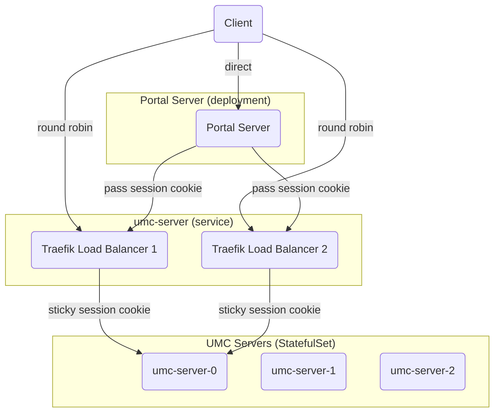

# Load balancing for UMC servers

---

- status: accepted
- date: 2024-06-13
- author: @cgarcia
- approval level: low
- coordinated with: Nubus Team
- source: https://git.knut.univention.de/univention/customers/dataport/team-souvap/-/issues/406
- scope: Nubus

---

## Context and Problem Statement

We want to have multiple instances of the UMC server to share the load.

## Decision Drivers

- The UMC server is stateful, it creates a thread per logged in user session. If the thread is not there, login has to happen again.
- Both the end user's browser and the portal server need to reach the UMC server instance with the user session.

## Considered Options

- Sticky session in the k8s ingress.
- Making the portal access the UMC server externally (through the ingress).
- Bundling together the UMC Server and the Portal Server.
- Making the UMC server stateless.
- Load balancer in front of the UMC servers.

### Option 1: Sticky session in the k8s ingress

The first option, “Sticky session in the k8s ingress”, did not work because the ingress is used only for external traffic, so the portal server would connect to a random UMC server each time since it does not go through the ingress.

### Option 2: Making the portal access the UMC server externally (through the ingress)

The second option, “Making the portal access the UMC server externally (through the ingress)”, was avoided because of just being a workaround that would impact performance and make the architecture more complex.

### Option 3: Bundling together the UMC Server and the Portal Server

The third option has some advantages, such as allowing for autoscailing and
being able to use the existing ingress for the sticky session. However, it would
bundle together two components that shouldn't have been so tightly coupled on
the first place. Since we expect to improve the UMC server in the future, we
decided to avoid this option.

### Option 4: Making the UMC server stateless

The fourth option, “Making the UMC server stateless”, would be the best option
in the long term. It should be possible to store the session data in a shared
memcached instance (or similar). Since it's not trivial to adapt the code,
it was not tested. But what we tested was:

- The service re-creates LDAP connections if they are dropped (restarted LDAP server)
- The service re-creates per-user processes if they are killed (killed PID)

These do not lead to the session being expired or the user having to login
again for these reasons. As such it was explored whether the service could
read/write session information from a central service (memcached i.e.) instead
of reading/writing to memory. While this avenue seems feasible, for reasons of
datastructure complexity (references that could not be retained using methods
like JSON or pickle) this implementation could require a more extended code
change (the way data is stored and read).

This could be re-visited if the respective code is being modified for other
reasons (i.e. SAML refresh/expiry, addressing resouce usage, cleanup of
sessions, etc.).

## Decision Outcome

Chosen option: “Load balancer in front of the UMC servers”, because it is the
simplest viable option.

### Implementation Details

We made the UMC server a StatefulSet (was previously a Deployment) with
multiple replicas and a headless service for each so that they could be
internally reached directly (e.g.: I want to talk with `umc-server-0`). Then,
we added a Deployment of pod(s) running Traefik in front, which load balance
the requests to the backends keeping sticky session with a custom cookie. The
portal server forwards the cookies from the client, so it does also get routed
to the right UMC server instance. Since the cookie is just some kind of hash of
the backend server, the load balancer instances can be easily scaled.

To ensure that the servers are healthy, Treafik should be configured to do so.
We decided to do a periodic health check to the UMC servers. Treafik is able to
so: <https://doc.traefik.io/traefik/routing/services/#health-check>.

### Consequences

- Good, because the problem of the UMC server being stateful is solved.
- Good, because there are no limits to scaling.
- Bad, added complexity to the architecture.
- Bad, added another “jump” for the requests to go through.

### Risks

- If autoscailing is needed, we would have to change to the third option.
- There is no high availability for the UMC servers. If an instance dies and the
  sticky session is lost, the user will have to login again once routed to
  another instance or when the original instance is back up.

## More Information

Kubernetes is designed for stateless services, and everything is way easier if
they are. Stateful services that have to scale in Kubernetes are still more or
less a common thing, but we might have been the first ones to have a stateful
service that is reached both from the outside world and within the cluster.

In the future, we might want to consider making the UMC server stateless.

The current implementation does not support autoscailing, since the number of
UMC server instances should be fixed before deployment. It's not a requirement
for now, but it might be in the future.
