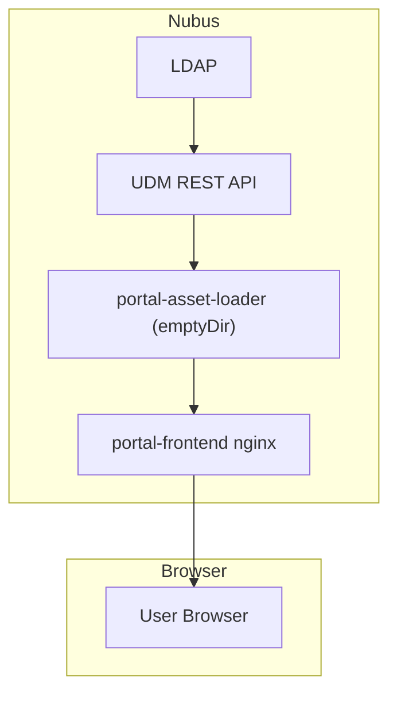

# Portal asset serving and change detection

---

- status: draft
- date: 2026-02-9
- author: @jlohmer
- approval level: medium
- coordinated with: Daniel Tröder, Ingo Steuwer, Nubus Core team, Nautilus Team.
- source: univention/dev/internal/team-nubus#1589, univention/dev/internal/team-nubus#1556
- scope: Nubus for Kubernetes

---

## Context and Problem Statement

Nubus for Kubernetes needs to become Ingress agnostic.
All uses of path rewrites using regex need to be removed.
Portal assets are currently served from S3 via Ingress-Nginx using `nginx.ingress.kubernetes.io/rewrite-target`
to rewrite paths like `/univention/(portal|selfservice)/icons/(logos|entries)/(.*)$` to the S3 bucket.
Removing the ingress-nginx dependency is actively requested by openDesk 13.

Minio, the default S3 backend of Nubus, is also deprecated / unmaintained.
We need to migrate away from Minio or better,
remove the dependency of Nubus on S3 entirely.
Removing S3 is actively requested by openDesk 8.

Portal assets (SVG icons for portal entries and logos) are served to end users
through a long chain of components in Nubus for Kubernetes.
The current pipeline involves 12 container images, 14 HTTP requests,
and 7 storage locations (LDAP -> Listener -> Notifier -> NATS -> UDM Transformer -> Provisioning API -> Dispatcher -> Portal Consumer -> S3 -> Ingress-Nginx).

For comparison, Keycloak implements the equivalent feature (uploading and serving a custom logo)
with 5 requests, 1 storage location, and 2 containers.

The portal-consumer does not actually use the content of the provisioning message.
It only evaluates the DN and triggers a full resync of all assets when something changes.

## Decision Drivers

- Remove dependency on Ingress-Nginx path rewrites.
- Remove dependency on Minio / S3.
  Simplifies the deployment of Nubus
  Lowers cost of operating Nubus.
- Reduce accidental complexity in the portal-asset pipeline.
- Solution must scale with multiple portal-frontend replicas.
- Compatible with the migration plan for the portal configuration from LDAP to PostgreSQL

## Considered Options

- Option 1: Simple polling sidecar (portal-asset-loader)
- Option 2: Nginx sidecar on Portal-Consumer with frontend caching
- Option 3: Portal-Consumer as sidecar with provisioning pipeline
- Option 4: Portal-Consumer with NATS KV intermediate store

## Pros and Cons of the Options

### Option 1: Simple polling sidecar (portal-asset-loader)

A new lightweight sidecar in the portal-frontend pod polls the UDM REST API for changes
using ETags on collection endpoints and loads assets directly from UDM REST API.
Writes to a shared emptyDir volume. No provisioning pipeline involvement for assets.

- Good, because it significantly reduces complexity (5 requests, 2 storage locations, 4 containers).
- Good, because it removes S3, Ingress-Nginx, and provisioning pipeline dependencies for assets.
- Good, because it scales trivially — each replica polls independently.
- Good, because it is a simple component that is easy to maintain and debug.
- Bad, because changes are not detected instantly (polling delay of 10s–5min depending on configuration).
- Bad, because it adds load to UDM REST API proportional to the number of portal-frontend replicas.
- Neutral, because it introduces a new component, but allows removing the portal-consumer's asset responsibilities.

### Option 2: Nginx sidecar on Portal-Consumer with frontend caching

Add a new nginx sidecar container to the Portal-Consumer pod.
The portal-consumer writes assets to a shared emptyDir volume, and the nginx sidecar serves them.
The portal-frontend nginx acts as a caching reverse proxy and load-balances requests across portal-consumer nginx sidecars.

- Good, because it removes S3 and Ingress-Nginx path rewrite dependencies.
- Good, because the portal-frontend nginx cache makes it scalable — frontend replicas serve cached assets independently.
- Good, because change detection remains responsive via the existing provisioning pipeline.
- Bad, because it is not highly available — if the single portal-consumer pod goes down, cache misses will fail until it recovers.
- Bad, because it keeps the full provisioning pipeline involved for asset delivery.
- Bad, because it adds a new nginx sidecar container and caching configuration complexity.
- Neutral, because the portal-frontend cache TTL creates a trade-off between freshness and availability.

### Option 3: Portal-Consumer as sidecar with provisioning pipeline

Deploy the existing portal-consumer as a sidecar to each portal-frontend pod.
It receives change events through the full provisioning pipeline and writes assets to a shared emptyDir volume.
The portal-frontend nginx serves assets from the emptyDir.

- Not Possible, because nats supports multiple consumers for the same queue but the Provisioning API dose not.

### Option 4: Portal-Consumer with NATS KV intermediate store

Keep a single portal-consumer receiving events via provisioning.
It writes assets to NATS KV instead of S3.
A new portal-asset-loader sidecar in each portal-frontend pod reads from NATS KV and writes to emptyDir.

- Good, because it removes S3 and Ingress-Nginx dependencies.
- Good, because scaling portal-frontend replicas works (each sidecar reads from NATS KV independently).
- Bad, because it keeps the full provisioning pipeline.
- Bad, because it adds a new storage location (NATS KV) and a new container (portal-asset-loader), increasing complexity (15 requests, 8 storage locations).

## Decision Outcome

Chosen option: "Option 1: Simple polling sidecar (portal-asset-loader)", because
it is the only option that substantially reduces the complexity of the asset pipeline
while removing both deprecated dependencies (S3/Minio and Ingress-Nginx).

### Consequences

- Good, because it removes the Minio/S3 dependency for portal assets.
- Good, because it removes the Ingress-Nginx path rewrite dependency for portal assets.
- Good, because it simplifies the portal asset data flow from 14 requests / 7 storage locations to 5 / 2.
- Good, because it reduces the portal-consumer's responsibilities, making it easier to maintain.
- Good, because the solution is incremental and can be delivered in stages (see Milestones below).
- Bad, because asset updates have a polling delay rather than being event-driven.
- Bad, because each portal-frontend replica independently loads assets from UDM REST API.

### Risks

- Small risk: Polling interval too slow for some customers. Mitigated by making it configurable.
- Small risk: UDM REST API load scales with replica count. Mitigated by polling interval and ETag support (~33ms for 304).

## More Information

### New Architecture

### Benchmarks

UDM REST API and LDAP benchmarks from a test cluster:

| Test | Avg Latency | Throughput |
|------|-------------|------------|
| UDM REST API without ETag (HTTP 200) | 36.0ms | 27.8 req/s |
| UDM REST API with ETag (HTTP 304) | 33.5ms | 29.9 req/s |
| LDAP search (single connection) | 0.47ms | 2133.8 req/s |
| LDAP search (concurrent) | 0.44ms | 2262.2 req/s |

### ETag considerations

The UDM REST API supports ETags for collection endpoints.
The portal-asset-loader can use `If-None-Match` headers to avoid re-downloading unchanged assets.
The ETag for collection endpoints is computed from the objects' DNs and entryCSNs,
making it stable regardless of query parameters.

### Related ADRs

- [ADR-0012: Portal branding and theming customizations](0012-portal-branding-customizations.md)
