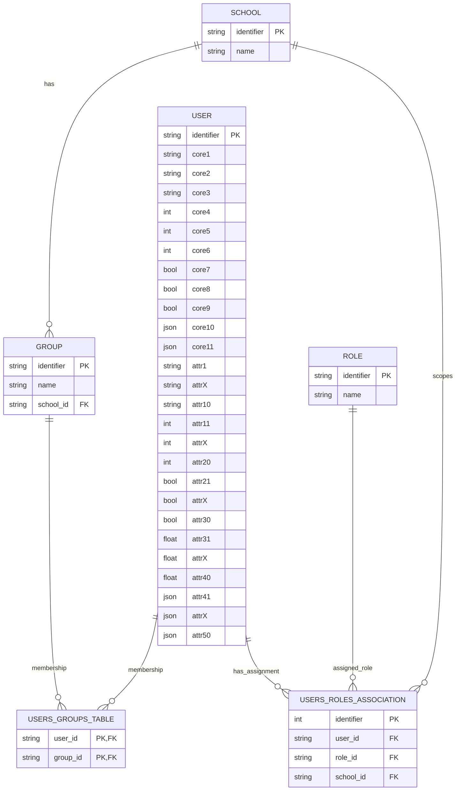
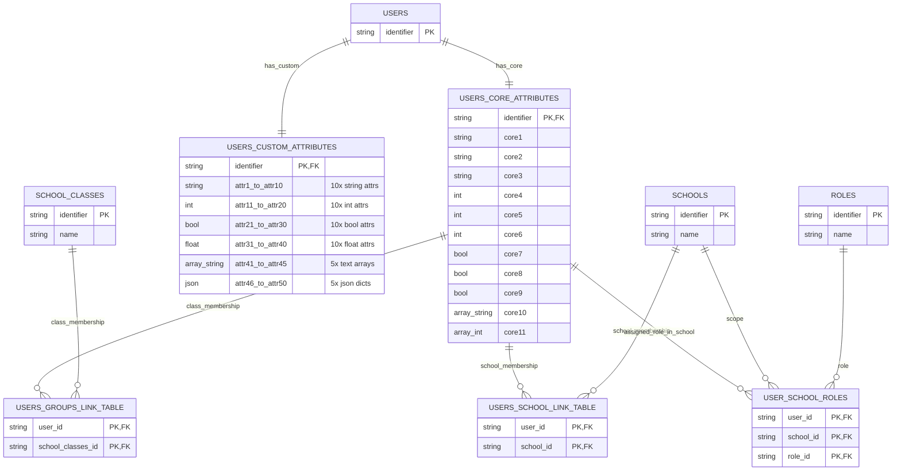
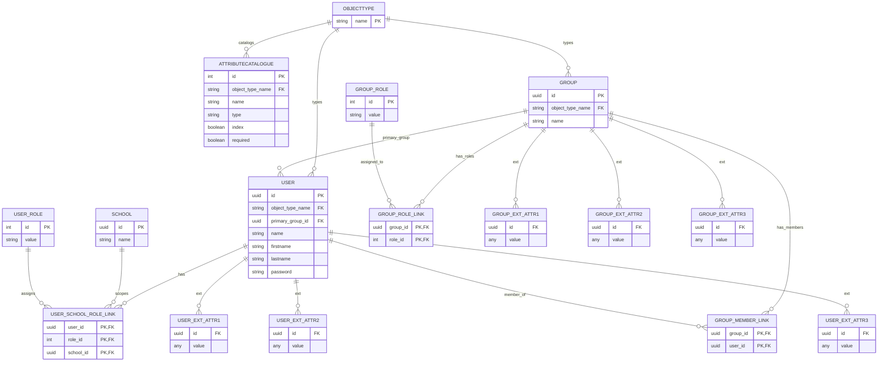
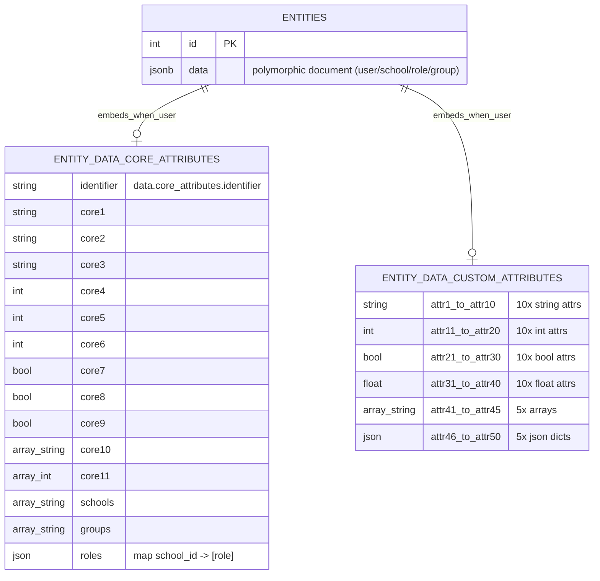
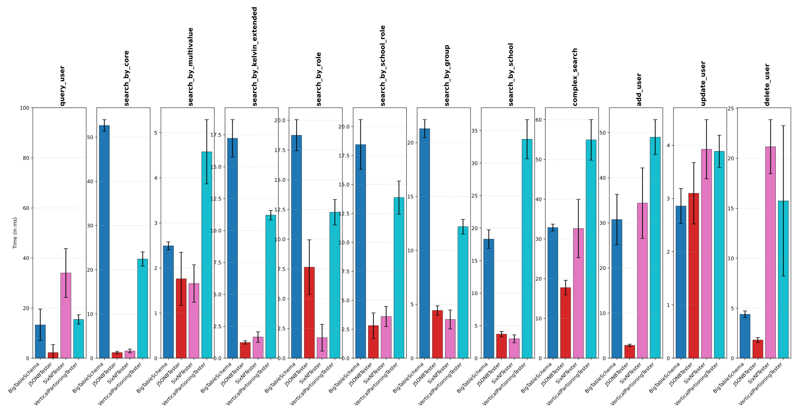

# Extended Attributes Storage Model for Kelvin V2

---

- status: accepted
- supersedes: -
- superseded by: -
- date: 2026-02-27
- author: Team education (ByteBenders)
- approval level: low
- coordinated with: System Architect
- source: Kelvin V2 data-model spike (univention/dev/education/ucsschool-kelvin-rest-api#182)
- scope: Kelvin V2
- resubmission: Might reopen when use-case and data-flow collection (ongoing tasks) are completed.

---

## Context and Problem Statement

Kelvin V2 manages user objects that carry a fixed set of **core attributes** (name, identifiers, booleans, etc.) as well as up to **50 customer-defined extended attributes** whose schema varies per deployment. Extended attributes may be strings, integers, booleans, floats, lists, or JSON maps. Customers expect to add, modify, and remove extended attributes over the lifecycle of a deployment.

Queries on extended attributes must meet the **same performance targets** as queries on built-in core attributes (see [dev/education/ucsschool-kelvin-rest-api:doc/dev/requirements/requirements-nonfunctional.rst](https://git.knut.univention.de/univention/dev/education/ucsschool-kelvin-rest-api/-/blob/981e4961b03b144f8338c62ecd72f97caaa9ee9b/doc/dev/requirements/requirements-nonfunctional.rst#L305)):

| Operation (SERVER_MEDIUM, ~8.25 M users) | p95 target | p99 target |
| --- | --- | --- |
| DB point lookup | ≤ 20 ms | ≤ 50 ms |
| DB range / filtered query | ≤ 100 ms | ≤ 300 ms |
| DB single-row write | ≤ 100 ms | ≤ 300 ms |

The question is: **Which relational storage pattern should Kelvin V2 use for extended attributes?**

A spike was conducted in [this repository](https://git.knut.univention.de/univention/dev/internal/research-library/-/tree/4b82e4b527c478722ff8be9d39dc2ad95dbee31c/research/kelvin_v2/kelvin_db_performance) where all four candidate patterns were implemented end-to-end (schema, provisioning, CRUD, search) against a PostgreSQL database loaded with the SERVER_MEDIUM reference dataset (6,000 schools, ~8.25 M users, 50 custom attributes per user). Each operation was benchmarked with 20 repetitions.

## Decision Drivers

- **Query performance**: extended-attribute queries must meet the same latency targets as core-attribute queries, including single-field filters, multi-field filters, range queries, and school-scoped searches.
- **Type safety and data integrity**: the storage layer should enforce types (string, int, bool, float, list, JSON) to prevent data corruption.
- **Schema flexibility**: customers add and remove extended attributes at runtime; the chosen pattern must support this without downtime or prohibitive migration cost.
- **Operational simplicity**: the number of database objects (tables, indexes) and the complexity of ORM / application code should remain manageable.
- **Scalability**: the pattern must scale from SERVER_DEV (~835 K users) through SERVER_MEDIUM (~8.25 M users) to SERVER_LARGE (~34 M users).
- **Cross-database portability**: avoid hard dependency on PostgreSQL-only features where possible.

## Considered Options

1. **Big Table** — all core and extended attributes as columns in a single wide `users` table.
2. **Vertical Partitioning (EAV-like)** — core attributes and extended attributes in separate wide tables, linked by FK. *(Note: this is not true Entity-Attribute-Value with key-value rows; it vertically partitions the wide table into a core and a custom segment.)*
3. **Sixth Normal Form (6NF)** — one dynamically-created table per extended attribute, each containing `(user_id, value)`.
4. **JSONB** — all attributes stored as a single JSONB document in a polymorphic `entities` table.

---

## Pros and Cons of the Options

### Option 1 — Big Table

All core attributes (core1–core11) and all 50 extended attributes (attr1–attr50) live as individual columns in a single `users` table. Each scalar attribute has its own B-tree index. Array and JSON attributes are stored as `JSON`/`ARRAY` types without indexes. Roles are modeled via a three-way association table `(user_id, role_id, school_id)`, and groups via a simple M2M link table.

Implementation: [big_table_schema.py](https://git.knut.univention.de/univention/dev/internal/research-library/-/blob/4b82e4b527c478722ff8be9d39dc2ad95dbee31c/research/kelvin_v2/kelvin_db_performance/src/kelvin_db_performance/big_table_schema.py)

- **Query performance — single-field filter**: Good. Standard B-tree index scan on a native column. Spike result: `search_by_kelvin_extended` mean **16.8 ms**.
- **Query performance — multi-field filter**: Good. Multiple indexed columns in the same table require no JOINs; the planner can combine index scans or use a composite scan. Spike result: `complex_search` mean **32.8 ms** (well within 100 ms p95 target).
- **Range queries / sorting**: Good. Native B-tree indexes support `ORDER BY`, `BETWEEN`, `>`, `<` natively. No casting or extraction required.
- **Type safety**: Good. Each column has a native SQL type (`INTEGER`, `BOOLEAN`, `FLOAT`, `TEXT`, `ARRAY`, `JSON`). The database enforces types at insert/update time.
- **Schema management**: Bad. Adding or removing an extended attribute requires `ALTER TABLE … ADD/DROP COLUMN` on a table with millions of rows. On PostgreSQL, adding a nullable column without a default is metadata-only (fast), but adding a column with a `NOT NULL` constraint or a default requires a table rewrite.
- **Table proliferation**: Good. Very few tables: `users`, `school`, `role`, `group`, plus two link tables. Roughly **6 tables** total.
- **ORM / application code**: Good. Straightforward 1:1 mapping between ORM model class and SQL table. Standard SQLAlchemy / SQLModel patterns apply.
- **Statistics & plan quality**: Good. PostgreSQL maintains per-column statistics (histograms, MCV lists, distinct counts). The query planner has full visibility into data distribution for every attribute.
- **Sparse data**: Bad. Every user row allocates storage for all 50+ extended-attribute columns even when most are `NULL`. With millions of rows this translates to significant wasted space and wider row reads.
- **Migrations / field deletion**: Bad. `ALTER TABLE DROP COLUMN` on a multi-million-row table can be slow and requires careful coordination. Adding an index on a new column also requires `CREATE INDEX CONCURRENTLY`, which takes time proportional to table size.
- **Cross-database portability**: Good. Only standard SQL types and indexes are used. No PostgreSQL-specific extensions.
- **Scaling to many fields**: Bad. PostgreSQL has a hard limit of ~1,600 columns per table. As the number of extended attributes grows, the table becomes increasingly wide, heap pages become large, and sequential scans slow down. Performance degrades non-linearly.

---

### Option 2 — Vertical Partitioning (EAV-like)

The user's identity is stored in a thin `users` table (identifier only). Core attributes live in a `users_core_attributes` table (1:1 FK), and all extended attributes live in a separate `users_custom_attributes` table (1:1 FK). Both are still wide tables with individual columns for every attribute. Schools, roles, and groups are modeled via dedicated link tables. This is **not true EAV** (no key-value rows); it is a vertical partition of the wide Big Table.

Implementation: [schema_vertical_partioning.py](https://git.knut.univention.de/univention/dev/internal/research-library/-/blob/4b82e4b527c478722ff8be9d39dc2ad95dbee31c/research/kelvin_v2/kelvin_db_performance/src/kelvin_db_performance/schema_vertical_partioning.py)

- **Query performance — single-field filter**: Good. Same B-tree index scan as Big Table, but a JOIN is needed between `users` and `users_custom_attributes`. Spike result: `search_by_kelvin_extended` mean **11.2 ms**.
- **Query performance — multi-field filter**: Neutral. Filters that span core and custom attributes require a JOIN between the two attribute tables, adding planner complexity. Spike result: `complex_search` mean **54.9 ms** (within target, but ~67% slower than Big Table).
- **Range queries / sorting**: Good. Same native B-tree behavior as Big Table. Columns are typed and indexed normally.
- **Type safety**: Good. Identical to Big Table — native SQL column types enforce constraints.
- **Schema management**: Bad. Same problem as Big Table: `ALTER TABLE` on `users_custom_attributes` for adding or removing fields. The table is slightly smaller (no core columns), but still has millions of rows.
- **Table proliferation**: Good. A few more tables than Big Table (splitting core/custom adds 1–2 tables), but still a small, fixed number. Roughly **9 tables** total.
- **ORM / application code**: Good. Each table maps to one ORM model. Querying a full user requires a JOIN across 2–3 tables, which is standard SQLAlchemy relationship loading.
- **Statistics & plan quality**: Good. Per-column statistics are maintained, same as Big Table.
- **Sparse data**: Bad. Same as Big Table — the custom attributes table still has all columns. Each row stores NULLs for unused attributes.
- **Migrations / field deletion**: Bad. Same `ALTER TABLE` requirements, though the custom table is somewhat smaller (no core columns), marginally reducing rewrite time.
- **Cross-database portability**: Good. Standard SQL only.
- **Scaling to many fields**: Neutral. Splitting core from custom attributes buys some headroom (each table is narrower), but the fundamental column-limit and wide-row issues still apply to `users_custom_attributes`.

---

### Option 3 — Sixth Normal Form (6NF)

Core user attributes (name, firstname, lastname, password) live in a fixed `user` table. Each extended attribute gets its own dynamically-created table (e.g., `user_ext_attr1`, `user_ext_attr29`), containing just `(user_id FK, value)`. A metadata catalog (`objecttype` + `attributecatalogue`) tracks which dynamic tables exist, their types, and indexing. ORM models are generated at runtime via `pydantic.create_model()` / SQLModel. Multi-value attributes (lists) are stored as multiple rows with an auto-increment PK.

Implementation: [six_nf.py](https://git.knut.univention.de/univention/dev/internal/research-library/-/blob/4b82e4b527c478722ff8be9d39dc2ad95dbee31c/research/kelvin_v2/kelvin_db_performance/src/kelvin_db_performance/six_nf.py)

- **Query performance — single-field filter**: Excellent. A query on one extended attribute hits a tiny, dedicated, fully-indexed table. Spike result: `search_by_kelvin_extended` mean **1.7 ms** — 10× faster than Big Table.
- **Query performance — multi-field filter**: Good. After fixing bugs in the schema tester, multi-table JOINs perform well within targets. Spike results: `complex_search` mean **32.6 ms**, `search_by_school_role` mean **3.6 ms**, `search_by_school` mean **3.0 ms** — all well within the 100 ms p95 target. The only remaining concern is `query_user` (full-object retrieval across 50+ JOINs) at mean **34.0 ms**, which exceeds the 20 ms point-lookup p95 target.
- **Range queries / sorting**: Good (per attribute). Each attribute table has a native typed column with a B-tree index — `ORDER BY`, `BETWEEN`, etc. work efficiently on a single attribute. Sorting across multiple dynamic attributes is impractical.
- **Type safety**: Good. Each dynamic table has a properly typed `value` column (e.g., `INTEGER`, `BOOLEAN`, `TEXT`). Type enforcement happens at the database level.
- **Schema management**: Good. Adding an attribute is `CREATE TABLE` (fast, no rewrite of existing data). The attribute catalog is updated with a simple `INSERT`. No DDL on existing large tables.
- **Table proliferation**: Bad. With 50 extended attributes per object type, and potentially multiple object types (users, groups), the database accumulates **50+ dynamic tables** plus metadata and link tables. Total easily exceeds **70 tables**. Monitoring, backup verification, and schema inspection become harder.
- **ORM / application code**: Bad. ORM models must be generated dynamically at application startup. Full-user queries require programmatically building LEFT JOINs across all attribute tables. The implementation in the spike uses `pydantic.create_model()` and manual SQLModel wiring, which is non-trivial and hard to debug.
- **Statistics & plan quality**: Good. Each small table has its own statistics. The planner can make optimal decisions per table. However, when many tables are JOINed, the planner's cost estimates may become unreliable due to join-order combinatorics.
- **Sparse data**: Excellent. If a user does not have a value for an attribute, no row exists in that attribute's table. Storage is perfectly proportional to actual data density.
- **Migrations / field deletion**: Excellent. Deleting an attribute is `DROP TABLE` — instant, no data scanning. No migration scripts needed.
- **Cross-database portability**: Neutral. The pattern uses standard SQL, but the runtime DDL (`CREATE TABLE`, `DROP TABLE`) and dynamic model generation add coupling to the specific ORM and driver.
- **Scaling to many fields**: Good. Each new attribute is just one more small table. No column-limit concerns. However, query complexity (JOINs) grows linearly with the number of attributes referenced in a single query.

---

### Option 4 — JSONB

All entities (users, schools, roles, groups) are stored in a single `entities` table with an auto-increment `id` and a `data JSONB` column. Core and extended attributes are nested JSON keys within the document. Indexes include: a GIN index with `jsonb_path_ops` for containment queries (`@>`), functional B-tree indexes on selected numeric paths, and a GIN trigram index (requires `pg_trgm` extension) for `LIKE` queries on text paths.

Implementation: [jsonb.py](https://git.knut.univention.de/univention/dev/internal/research-library/-/blob/4b82e4b527c478722ff8be9d39dc2ad95dbee31c/research/kelvin_v2/kelvin_db_performance/src/kelvin_db_performance/jsonb.py)

- **Query performance — single-field filter**: Excellent. Containment-based lookups (`data @> '{"custom_attributes": {"attr21": true}}'`) use the GIN index. Functional B-tree indexes support equality/range on specific paths. Spike result: `search_by_kelvin_extended` mean **1.2 ms** — the fastest of all four options.
- **Query performance — multi-field filter**: Good. After fixing bugs in the schema tester, complex filtered queries that combine containment, range, and LIKE predicates now leverage indexes effectively. Spike result: `complex_search` mean **17.8 ms** — the best of all four options and well within the 100 ms p95 target.
- **Range queries / sorting**: Neutral. Functional B-tree indexes on specific JSON paths support range queries, but each path needs its own index defined upfront. Sorting on a JSON path requires explicit casting (`(data->'path')::float`), which the planner handles less efficiently than native columns.
- **Type safety**: Bad. JSONB stores everything as JSON primitives (string, number, boolean, null, array, object). There is no database-level enforcement of per-field types. A string could be inserted where an integer is expected. Type validation must be handled entirely in application code.
- **Schema management**: Excellent. No DDL needed to add, modify, or remove extended attributes. The JSONB document is schema-free. Changes are application-level only.
- **Table proliferation**: Excellent. A single `entities` table stores everything. The entire data model is **1 table** plus indexes.
- **ORM / application code**: Neutral. Inserting and updating documents is simple. However, querying requires building JSON path expressions, containment operators, and casts — which is less intuitive than column-based filtering. ORMs do not natively support JSONB query patterns, requiring custom query construction.
- **Statistics & plan quality**: Bad. PostgreSQL does not maintain per-key statistics inside JSONB columns. The planner cannot estimate selectivity for predicates on individual JSON paths, leading to poor cardinality estimates and suboptimal query plans, especially for multi-predicate queries.
- **Sparse data**: Good. Missing keys simply do not appear in the JSON document. No storage is wasted.
- **Migrations / field deletion**: Excellent. Removing a field requires no DDL. Application code simply stops writing that key. Existing documents can be cleaned up lazily or via a background `jsonb - 'key'` update.
- **Cross-database portability**: Bad. `JSONB`, GIN indexes, `jsonb_path_ops`, jsonpath operators (`@?`), and `pg_trgm` are PostgreSQL-specific. Migrating to MySQL, MariaDB, or SQL Server would require significant rework.
- **Scaling to many fields**: Neutral. The document size grows linearly with the number of fields, but no column limits apply. However, GIN indexes become larger and slower to maintain as document complexity increases. Each new field that needs indexed range queries requires a separate functional B-tree index.

---

## Comparison Matrix

Summary across all 12 evaluation dimensions (⬤ = strong, ◑ = acceptable, ○ = weak):

| Dimension | Big Table | Vertical Part. | 6NF | JSONB |
| --- | :---: | :---: | :---: | :---: |
| Single-field filter | ◑ | ◑ | ⬤ | ⬤ |
| Multi-field filter | ⬤ | ◑ | ⬤ | ⬤ |
| Range queries / sorting | ⬤ | ⬤ | ◑ | ◑ |
| Type safety | ⬤ | ⬤ | ⬤ | ○ |
| Schema management | ○ | ○ | ⬤ | ⬤ |
| Table proliferation | ⬤ | ⬤ | ○ | ⬤ |
| ORM / application code | ⬤ | ⬤ | ○ | ◑ |
| Statistics & plan quality | ⬤ | ⬤ | ◑ | ○ |
| Sparse data | ○ | ○ | ⬤ | ⬤ |
| Migrations / field deletion | ○ | ○ | ⬤ | ⬤ |
| Cross-database portability | ⬤ | ⬤ | ◑ | ○ |
| Scaling to many fields | ○ | ○ | ⬤ | ◑ |

## Benchmark Results

All measurements from the spike on the SERVER_MEDIUM reference dataset (~8.25 M users, 6,000 schools, 50 extended attributes per user, PostgreSQL). Each operation was run 20 times. Values are in **milliseconds**.

> [!important] Notes on Benchmark Methodology
>
> ### Provisioning timing & storage
>
> | Schema | Provisioning Time | Storage (incl Indicies) |
> | --- | ---: | ---: |
> | Big Table | 4h | 48 GB |
> | Vertical Partitioning | 2.5h (12 parallel processes) | 42 GB |
> | 6NF | 19_374 s (~5.4 h) | 97 GB |
> | JSONB | 11_118 s (~3.1 h) | 66 GB |
>
> JSONB provisions 1.7× faster and uses 32% less storage than 6NF.
>
> ### UUID primary keys
>
> All four schemas used `UUID` as the primary key type. This is not optimal for database performance — `bigserial` (auto-increment `BIGINT`) offers faster comparison (8 bytes vs. 16 bytes), better B-tree index locality (sequential inserts), and a smaller index footprint. Switching to `bigserial` or the database-preferred native integer PK type could improve all schemas, especially join-heavy ones like 6NF (where `query_user` joins 50+ tables on the PK). The spike results therefore represent a **conservative upper bound** on achievable performance.

### Mean Latency (ms)

| Operation | Big Table | Vertical Part. | 6NF | JSONB |
| --- | ---: | ---: | ---: | ---: |
| `query_user` (point lookup) | 13.3 | 15.5 | **34.0** | 2.2 |
| `search_by_core` (core attr filter) | **52.6** | **22.5** | 1.7 | 1.3 |
| `search_by_multivalue` (array attr) | 2.5 | 4.6 | 1.7 | 1.8 |
| `search_by_kelvin_extended` (ext attr) | 17.2 | 11.2 | 1.7 | 1.2 |
| `search_by_role` | 18.7 | 12.3 | 1.7 | 7.7 |
| `search_by_school_role` | 18.5 | 13.9 | 3.6 | 2.8 |
| `search_by_group` | 21.3 | 12.2 | 3.6 | 4.4 |
| `search_by_school` | 18.3 | **33.7** | 3.0 | 3.7 |
| `complex_search` (multi-predicate) | 32.9 | 54.9 | 32.6 | 17.8 |
| `add_user` (insert) | 30.7 | 49.0 | 34.4 | 2.9 |
| `update_user` | 2.9 | 3.9 | 3.9 | 3.1 |
| `delete_user` | 4.4 | 15.8 | 21.2 | 1.8 |

**Bold** = exceeds the point-lookup p95 target (20 ms) for operations classified as point lookups, or approaches the range-query / write targets.

### Latency Percentiles — p95 / p99 (ms)

| Operation | Big Table p95 | Big Table p99 | VP p95 | VP p99 | 6NF p95 | 6NF p99 | JSONB p95 | JSONB p99 |
| --- | ---: | ---: | ---: | ---: | ---: | ---: | ---: | ---: |
| `query_user` | 14.63 | 35.44 | 18.01 | 20.91 | **40.66** | **67.43** | 2.81 | 13.59 |
| `search_by_core` | **54.87** | **54.98** | **25.42** | 25.67 | 2.77 | 2.94 | 1.70 | 2.08 |
| `search_by_multivalue` | 2.63 | 2.74 | 5.63 | 6.35 | 2.77 | 2.94 | 2.36 | 3.54 |
| `search_by_kelvin_extended` | 20.07 | 21.03 | 11.80 | 11.86 | 2.77 | 2.94 | 1.44 | 1.53 |
| `search_by_role` | **21.25** | 21.35 | 13.35 | 15.78 | 2.11 | 5.69 | 12.02 | 14.73 |
| `search_by_school_role` | **22.05** | 23.85 | 16.62 | 18.13 | 5.21 | 5.53 | 4.16 | 4.26 |
| `search_by_group` | **22.45** | 22.49 | 13.29 | 13.33 | 4.71 | 5.42 | 5.23 | 5.38 |
| `search_by_school` | **20.43** | 22.23 | **39.43** | 39.53 | 3.90 | 4.30 | 4.39 | 4.92 |
| `complex_search` | 34.11 | 34.64 | 62.81 | 62.94 | 48.86 | 49.15 | 21.65 | 22.19 |
| `add_user` | 39.65 | 41.63 | 54.33 | 55.24 | 49.23 | 59.90 | 3.07 | 3.64 |
| `update_user` | 3.61 | 3.77 | 4.38 | 4.69 | 5.35 | 5.58 | 3.61 | 4.93 |
| `delete_user` | 5.03 | 5.33 | 18.71 | 42.34 | 25.85 | 26.56 | 2.30 | 2.44 |

**Bold** = exceeds the applicable target for its operation class (point lookup: p95 ≤ 20 ms, p99 ≤ 50 ms).

### Target Compliance (SERVER_MEDIUM)

Per-operation PASS/FAIL from the generated performance report. A schema passes a target category only if **all** operations in that class meet the threshold.

| Target | Big Table | Vertical Part. | 6NF | JSONB |
| --- | :---: | :---: | :---: | :---: |
| Point lookup p95 ≤ 20 ms | ❌ (5 of 6 fail) | ❌ (2 of 6 fail) | ❌ (1 of 6 fail) | ✅ |
| Point lookup p99 ≤ 50 ms | ❌ (`search_by_core` 54.98) | ✅ | ❌ (`query_user` 67.43) | ✅ |
| Range query p95 ≤ 100 ms | ✅ | ✅ | ✅ | ✅ |
| Range query p99 ≤ 300 ms | ✅ | ✅ | ✅ | ✅ |
| Single-row write p95 ≤ 100 ms | ✅ | ✅ | ✅ | ✅ |
| Single-row write p99 ≤ 300 ms | ✅ | ✅ | ✅ | ✅ |

**JSONB is the only schema that passes all performance targets.**

---

## Decision Outcome

**Accepted: Option 2 — Vertical Partitioning.**

The team chose Vertical Partitioning as the storage model for extended attributes in Kelvin V2, guided by KISS — keeping complexity low in the initial phase while retaining a clear migration path to 6NF if future performance requirements demand it. This decision might be reopened when the ongoing use-case and data-flow collection tasks are completed, as their outcomes could shift the weighting of decision drivers.

Vertical Partitioning meets or nearly meets all SERVER_MEDIUM performance targets. Only 2 of 6 point-lookup p95 thresholds are exceeded (`search_by_core` at 25.42 ms and `search_by_school` at 39.43 ms), while all p99 targets, all range-query targets, and all single-row write targets pass. These two marginal misses are accepted as a known trade-off for the simplicity gains outlined below.

Vertical Partitioning delivers the **best provisioning time** (2.5 h with 12 parallel processes) and the **smallest storage footprint** (42 GB) of all four candidates — better than JSONB (3.1 h / 66 GB), 6NF (5.4 h / 97 GB), and Big Table (4 h / 48 GB). This directly benefits deployment speed and infrastructure cost.

Schema changes — adding or dropping extended attributes — are performed via `ALTER TABLE` on the `users_custom_attributes` table during scheduled maintenance windows. On PostgreSQL, `ADD COLUMN` (nullable, no default) is a metadata-only operation (instant); `DROP COLUMN` is similarly fast. The team considers this an acceptable operational trade-off given that extended attribute schema changes are infrequent lifecycle events, not day-to-day operations.

**Why not JSONB (Option 4)?** Although JSONB is the only schema to pass all performance targets, the team decided against it for several reasons:

- **Stay in one technology — plain SQL.** Vertical Partitioning uses standard SQL columns, native ORM typing, and conventional B-tree indexes. JSONB requires a parallel skill set: JSON path expressions, containment operators (`@>`), jsonpath (`@?`), GIN indexes with `jsonb_path_ops`, and the `pg_trgm` extension. Keeping the codebase in one paradigm reduces cognitive load and onboarding time.
- **Database-level type safety.** Each column in the custom attributes table has a native SQL type (`INTEGER`, `BOOLEAN`, `FLOAT`, `TEXT`). The database rejects invalid types at insert/update time. JSONB has no per-field type enforcement — all validation must happen in application code, creating a silent data corruption risk.
- **Full query planner statistics.** PostgreSQL maintains per-column histograms, MCV lists, and distinct counts — giving the planner accurate selectivity estimates for every attribute. JSONB columns have no per-key statistics, leading to unreliable cardinality estimates and potentially suboptimal query plans as new filter patterns emerge.
- **No vendor lock-in.** Vertical Partitioning uses only standard SQL. JSONB, GIN indexes, `jsonb_path_ops`, jsonpath operators, and `pg_trgm` are PostgreSQL-specific. Avoiding this dependency keeps future database migration options open.

**Why not 6NF (Option 3)?** 6NF excels at single-field queries (1.7 ms mean) and offers the best schema flexibility (instant `CREATE TABLE` / `DROP TABLE`), but the team prioritizes avoiding its complexity:

- Full-object retrieval (`query_user`) requires 50+ LEFT JOINs, yielding a mean latency of 34.0 ms — failing the 20 ms point-lookup p95 target at 40.66 ms (p99: 67.43 ms). This is a structural limitation that grows linearly with attribute count.
- 70+ dynamic tables require runtime ORM model generation (`pydantic.create_model()`, manual SQLModel wiring), which is non-trivial to implement, debug, and maintain.
- Storage (97 GB) and provisioning time (5.4 h) are both the highest of all options.
- The migration path from Vertical Partitioning to 6NF remains open: individual extended attributes can be "promoted" to dedicated tables incrementally if specific query patterns demand it.

**Why not Big Table (Option 1)?** The single wide table fails 5 of 6 point-lookup p95 targets, has the worst provisioning time (4 h), the largest storage footprint (48 GB among columnar options), and the same `ALTER TABLE` schema management requirements as Vertical Partitioning — but without the benefit of separating core from custom concerns. The table is simply too wide at the 8.25 M user scale.

### Consequences

**Positive:**

- **KISS.** Lowest conceptual complexity of the viable options. Standard relational patterns — columns, B-tree indexes, FK JOINs — that any SQL-experienced developer can understand and maintain from day one.
- **Plain SQL and ORM typing.** The entire data layer uses conventional SQLAlchemy / SQLModel patterns. No JSON path expressions, no custom query builders, no containment operators. The team stays in one technology.
- **Meets nearly all SLO targets today.** All p99 targets, all range-query targets, and all write targets pass. The two marginal p95 misses (25.42 ms and 39.43 ms vs. 20 ms target) are within optimization reach.
- **Best provisioning time and lowest storage.** 2.5 h and 42 GB — faster and smaller than every other option.
- **Full database-level type safety.** Native SQL column types enforce data integrity at the database level. No application-layer type validation required for correctness.
- **Cross-database portable.** Only standard SQL types and indexes are used. No PostgreSQL-specific extensions, no vendor lock-in.
- **Excellent query planner statistics.** Per-column histograms, MCV lists, and distinct counts give the planner full visibility for reliable query plan quality.
- **Clean separation of concerns.** Core attributes (product-defined) and custom attributes (deployment-defined) evolve independently in separate tables.
- **Migration path to 6NF.** If specific extended attributes develop hot query patterns that exceed latency budgets, they can be promoted to dedicated 6NF-style tables incrementally — without affecting core attribute queries or the overall architecture.

**Negative:**

- **Two point-lookup p95 targets not met.** `search_by_core` (25.42 ms) and `search_by_school` (39.43 ms) exceed the 20 ms p95 target. Requires monitoring, index tuning, and potentially `bigserial` PK migration to resolve.
- **Maintenance window for schema changes.** Adding or dropping extended attributes via `ALTER TABLE` on `users_custom_attributes` requires a maintenance window. Not zero-downtime like JSONB or 6NF. Acceptable for infrequent lifecycle events, but a constraint nonetheless.
- **Sparse-data inefficiency.** The custom attributes table allocates all columns for every row, storing `NULL` for unused attributes. At 50 columns and 8.25 M rows, this wastes some storage and widens row reads compared to 6NF or JSONB.
- **Column limit ceiling.** PostgreSQL's ~1,600 column limit applies to `users_custom_attributes`. With 50 attributes today, this is distant but represents a hard ceiling if the attribute count grows significantly.

### Risks

1. **Marginal p95 misses.** Two operations exceed the 20 ms point-lookup p95 target. `bigserial` PKs and composite/covering indexes may resolve this, but the improvement magnitude is unknown and needs benchmarking. If these optimizations are insufficient, targeted 6NF promotion of the affected attributes is the fallback.
2. **Maintenance window dependency.** Schema changes require coordinated maintenance windows. If deployment SLAs tighten to near-zero-downtime requirements, the `ALTER TABLE` approach may become a bottleneck — triggering migration of hot attributes to 6NF-style tables.
3. **Wide-row growth.** If the number of customer-defined attributes grows significantly beyond 50, the custom attributes table re-encounters Big Table problems (wide rows, degraded sequential scans, column limit pressure). The team should define and enforce an upper-bound attribute count policy.
4. **SERVER_LARGE validation.** Behavior at ~34 M users is untested. The two marginal p95 operations may worsen at scale, and index maintenance costs need verification.
5. **UUID PK overhead.** All spike benchmarks used `UUID` primary keys. Switching to `bigserial` is expected to improve performance (smaller keys, better B-tree locality), but the gain is unquantified.

### Confirmation

The following steps are recommended to validate and optimize this decision:

1. **`bigserial` PK benchmark.** Re-run benchmarks with `bigserial` primary keys to quantify improvement and determine if the two marginal p95 misses can be resolved.
2. **SERVER_LARGE validation.** Benchmark Vertical Partitioning against the SERVER_LARGE dataset (~34 M users) to confirm target compliance at scale.
3. **API-level benchmarks.** Run end-to-end API benchmarks (not just DB-level) through the full FastAPI stack (serialization, validation, network) to confirm SLO compliance.
4. **`ALTER TABLE` timing measurement.** Test `ADD COLUMN` and `DROP COLUMN` on `users_custom_attributes` at SERVER_MEDIUM scale to quantify maintenance window duration and validate the "instant metadata-only" expectation.
5. **Maximum attribute count policy.** Define and document an upper bound on the number of extended attributes (e.g., ≤ 100) to prevent wide-row degradation.

## More Information

- Spike implementation and benchmark harness: [dev/internal/research-library:research/kelvin_v2/kelvin_db_performance/](https://git.knut.univention.de/univention/dev/internal/research-library/-/blob/4b82e4b527c478722ff8be9d39dc2ad95dbee31c/research/kelvin_v2/kelvin_db_performance/pyproject.toml#L36)
- Raw benchmark results: [dev/internal/research-library:research/kelvin_v2/kelvin_db_performance/results](https://git.knut.univention.de/univention/dev/internal/research-library/-/tree/4b82e4b527c478722ff8be9d39dc2ad95dbee31c/research/kelvin_v2/kelvin_db_performance/results)
- Performance requirements and reference environment definitions: [dev/education/ucsschool-kelvin-rest-api:doc/dev/requirements/requirements-nonfunctional.rst](https://git.knut.univention.de/univention/dev/education/ucsschool-kelvin-rest-api/-/blob/981e4961b03b144f8338c62ecd72f97caaa9ee9b/doc/dev/requirements/requirements-nonfunctional.rst)
